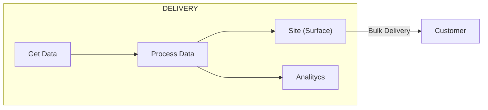

👋 Hello Everyone!!, I will share something about me:

- :soccer: I really love sports, soccer, surf, pool, pingpong, etc, and I love to write code.
- :surfing_man: I develop my website from scratch while I was learning React.
- :skier: My strong coding skills are Scala and Python. Also, I like the data, I eat Data. jejej
- :crossed_fingers: I am passionate about charting and graphs. Understand the charts then convert it to an actual fact, love it!
- :brain: My brain is often hungry to get more knowledge of everything, keep learning is my weakness.

---



---

# I have summarised many code lines to express my daily feelings through code

```python
import pandas as pd

# read or get data
df = pd.Dataframe(Random_dataframe)

# aggregate the data
group_df = df.groupBy('Column').agg({'quantity','sum'})

# reformating the data
pivot_df = group_df.pivot(index='Column', columns=['quantity'])
```

---
 :boom: Languales and Tools


---
:muscle: See my Github stats

[](https://github.com/moisesosorio/github-readme-stats)
