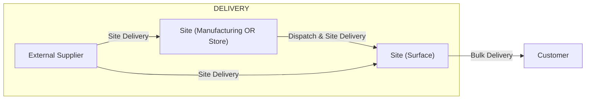

👋 Hello Everybody!!

- :soccer: I really love sports, soccer, surf, pool, pingpong, etc, and I love to write code.
- :surfing_man: I currently developing some courses such as Apache Spark, Apache NiFi etc
- :skier: My strong coding skills are Scala and Python. Also, I like the data, I eat Data. jejej
- :skier: I am passionate about charting and graphs. Understand the charts then convert it to an actual fact, love it!
- :skier: My brain is often hungry to get more knowledge of everything, keep learning is my weakness

---

---
 :boom: Languales and Tools

---
:muscle: See my Github stats

